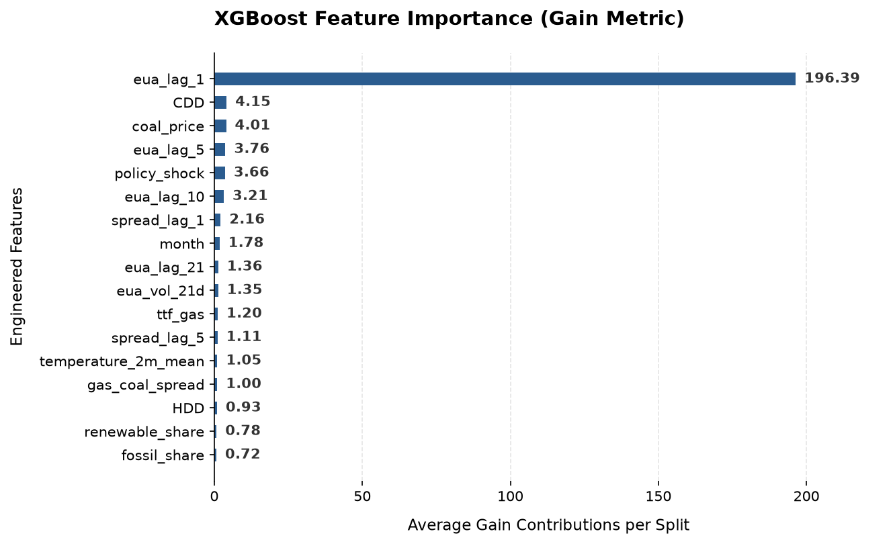
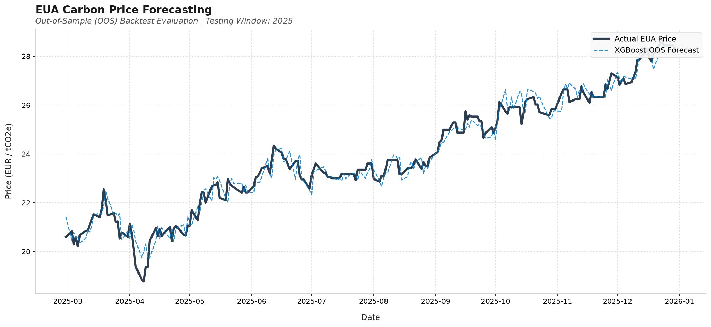

# EUA Carbon Price Forecasting

Causal forecasting of EU ETS Phase IV carbon allowance futures prices using
macro energy variables. Combines econometric validation (ADF, Granger causality,
VAR) with machine learning (XGBoost) on 2021–2025 daily data.

## Research Question
Can observable macro variables — gas-coal switching spreads, renewable generation
share, weather — provide statistically significant predictive information for
EUA price returns beyond the random walk? And does a causal ML model outperform
an ARIMAX benchmark?

## Variables
| Variable | Source | Causal Hypothesis |
|---|---|---|
| TTF–Coal Spread | Yahoo Finance | Switching signal: high gas → more coal → more EUAs needed |
| Renewable Share | ENTSO-E | High renewables → less fossil burn → EUA demand falls |
| HDD/CDD | Open-Meteo | Temperature → energy demand → ETS compliance pressure |
| Policy Dummies | Manual | Regulatory shocks produce discontinuous price jumps |

## Results
### Feature Importance Analysis

The chart below shows the average gain contributions of our engineered features, highlighting the dominant structural drivers behind EUA price movements.

### Out-of-Sample Performance

Our model's backtested predictions are plotted against actual historical prices across the holdout validation set.

## Key Findings
- The gas-coal spread is the single highest-gain feature (XGBoost importance)
- Granger causality confirmed for TTF gas at lag 1 and 3 (p < 0.05)
- XGBoost improves on the naive random walk RMSE by X% but directional
  accuracy remains near 55% — consistent with weak-form market efficiency
- VAR provides the most interpretable impulse-response analysis